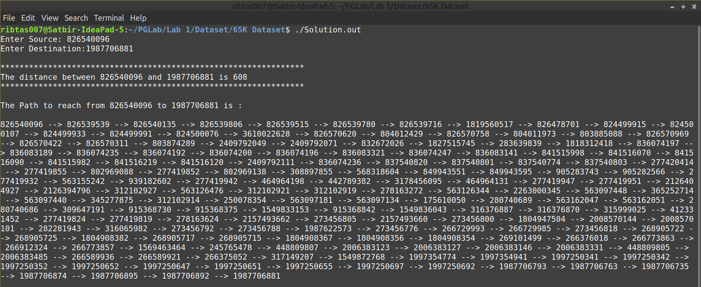

# PG LAB (CS509)

## Assignment 1

For this assignment, you are expected to implement Dijkstra's algorithm on directed graphs. 

The dataset is provided [here](Dataset).

**Note**: this dataset would likely be a large graph (around 100,000 nodes).

### Description of Input:

The input would consist of the following two files. 

Your code may assume that these files are present in the same directory as your code.

**Nodes.txt** --> This file contains information about the nodes of the graph. 

Data in the file is according to the following scheme

    <Node id as an positive integer> <new line>
    
    <Node id as an positive integer> <new line>
    
    ....
  
Following can be considered as a sample Nodes.txt

    343234
    
    8223
    
    123121
    
    ....
    
**Edges.txt** --> This file contains information about the edges of the graph. 

Data in the file is according to the following scheme

    <head Node id> <tail Node id> <edge weight as a positive integer> <new line>
    
    <head Node id> <tail Node id> <edge weight as a positive integer> <new line>
    
    ....
    
Following can be considered as a sample Edges.txt

    343234 8223 23
    
    123121 8223 89
    
    ....

### Function to be implemented:

A Dijkstra’s routine which takes the input graph, a source and a destination and outputs a shortest path between the two.

Your output should include both the path (the NodeIds) and the length of the path. In case the destination is not reachable
from the source, your code should print an appropriate message.

### Further instructions

* Design your code while considering its scalability. For example, you may note that adjacency matrix representation of the graph is usually not scalable beyond 70,000 nodes.
* Input Graph may have more than one connected component.
* Cover all cases, e.g., some nodes may have zero in-degree or out-degree or both.
* You should not use specialized libraries for storing graphs and/or running Dijkstra’s. You may use basic data structures like structures, arrays, hash_maps and associative arrays.

### Solution 

Download the [Solution](Solution.out) file. Open terminal and execute it by running `./Solution.out` command.

